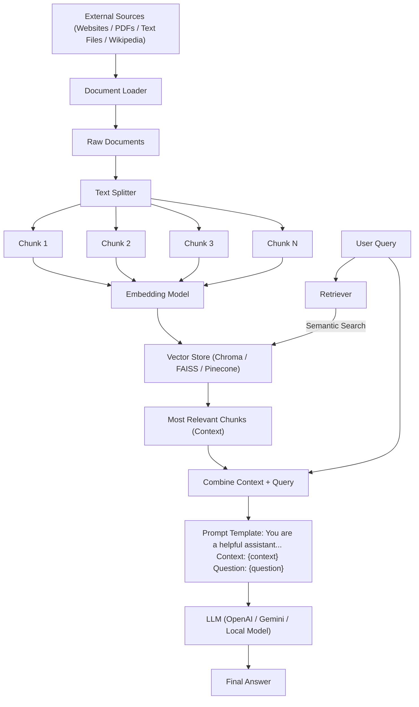

## 1. Introduction to RAG

**Retrieval-Augmented Generation (RAG)** is considered one of the most common and useful applications of Generative AI. It is a technique used to make Large Language Models (LLMs) smarter by providing them with **external context** at the time of a query, rather than relying solely on the model's internal training.

---

## 2. Why RAG? (The Limitations of LLMs)

While LLMs possess vast "parametric knowledge" stored in their weights and biases, they face three major challenges that RAG aims to solve:

1.  **Private Data:** LLMs are pre-trained on public internet data and lack access to your private company files, emails, or specific website data.
2.  **Knowledge Cutoff:** Every LLM has a date when its training ended. They cannot answer questions about **recent events** or real-time data unless they have an active internet search tool.
3.  **Hallucination:** LLMs are probabilistic; they sometimes "imagine" facts and present them with high confidence, even if they are totally incorrect.

---

## 3. Earlier Solutions: Fine-tuning & In-Context Learning

### A. Fine-tuning

Fine-tuning involves taking a pre-trained LLM and re-training it on a smaller, domain-specific dataset.

- **Analogy:** Pre-training is like an engineering student completing their degree, while fine-tuning is the 2-3 month job-specific training they receive after being hired.
- **Problems:** It is **computationally expensive**, requires high technical expertise (AI engineers), and is difficult to update if data changes frequently.

### B. In-Context Learning (ICL)

ICL is an **emergent property** of large models (like GPT-3) where the model learns to solve a task simply by seeing examples inside the prompt, without updating its weights.

- **Few-Shot Prompting:** Providing a few examples (e.g., sentiment analysis examples) within the prompt to guide the AI.
- **The Milestone:** This concept was popularized by the landmark paper _"Language Models are Few-Shot Learners"_.

---

## 4. How RAG Works: The 4-Step Process

RAG is essentially the "marriage" of **Information Retrieval** and **Text Generation**. It operates through four distinct stages:

### Step 1: Indexing (Preparing the Knowledge Base)

This is the process of creating an external knowledge base that can be searched efficiently.

1.  **Document Ingestion:** Loading source data (PDFs, URLs, S3 buckets) into memory.
2.  **Text Chunks:** Breaking large documents into smaller, meaningful segments to fit LLM context limits and improve search quality.
3.  **Embeddings:** Converting text chunks into **dense vectors** (numbers) that represent their semantic meaning.
4.  **Vector Store:** Saving these vectors and their original text in a specialized database (e.g., Chroma, Pinecone).

### Step 2: Retrieval

When a user asks a question, the system searches the vector store for the most relevant information.

1.  The user's query is converted into a vector using the **same embedding model**.
2.  A **semantic search** is performed to find the closest vectors in the store.
3.  The top-ranked results are fetched as the **Context**.

### Step 3: Augmentation

The system creates a new, "augmented" prompt that combines the user's original query with the retrieved context.

- **Instruction Example:** _"Answer the question only from the provided context. If you don't know, say I don't know"_.

### Step 4: Generation

The augmented prompt is sent to the LLM. The model uses its reasoning capabilities and the provided context to generate a **grounded response**.

---

## 5. RAG Flow Diagram

The following diagram illustrates the lifecycle of a RAG system:

---

## 6. RAG vs. Fine-tuning: Why RAG Wins for Most Apps

- **Cost:** RAG is much **cheaper** because it doesn't require expensive model re-training.
- **Updates:** Adding new information to RAG is as simple as adding a new document to the vector store, whereas fine-tuning requires a full training cycle.
- **Reliability:** RAG significantly reduces **hallucinations** by forcing the model to stick to the provided context (Grounding).
- **Simplicity:** It is a simpler alternative that doesn't require the same level of deep learning expertise as fine-tuning.
